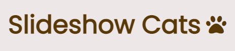

<h1 align="center">
  
</h1>

<p align="center">
  
  
  
</p>

_<p align="center">* Status: Concluído ✅</p>_

<p align="center">
 <a href="#sobre-o-projeto">Sobre</a> •
 <a href="#demonstração">Demonstração</a> • 
 <a href="#tecnologias-utilizadas">Tecnologias</a> • 
 <a href="#como-executar-o-projeto">Como executar</a> • 
 <a href="#licença">Licença</a>
</p>

---

## 📑 Sobre o projeto
Este miniprojeto consiste em um simples slide demonstrativo de gatinhos :cat:, desenvolvido majoritariamente com [CSS](https://developer.mozilla.org/pt-BR/docs/Web/CSS), com o intuito de colocar em prática as propriedades de transição e animação.

---

## 🎨 Demonstração

<div align="center">
  
</div>

---

## 🚀 Tecnologias utilizadas
As seguintes ferramentas foram utilizadas no desenvolvimento do projeto:
- [**HTML**](https://html.com/)
- [**CSS**](https://www.w3.org/Style/CSS/)
- [**Javascript**](javascript.com) (_Apenas para setInterval_)
- [**Visual Studio Code**](https://code.visualstudio.com/)

---

## 🛠️ Como executar o projeto

#### Pré-requisitos

Além de um <u>navegador de internet atualizado</u>, você precisa ter instalado em sua máquina as seguintes ferramentas: [Git](https://git-scm.com), [Node.js](https://nodejs.org/en/) e um editor de código como [VSCode](https://code.visualstudio.com/). Então, siga as instruções abaixo:
``` bash
# Clone este repositório:
$ git clone https://github.com/leonarclo/slideshow-cats.git

# Entre no diretório:
$ cd slideshow-cats

# Visualizaçao:
$ npx liver-server

```
---

## 📝 Licença
Este projeto está licenciado sob a licença MIT. Para mais detalhes, acesse o arquivo [LICENSE.md](https://github.com/leonarclo/slideshow-cats/blob/main/LICENSE).
